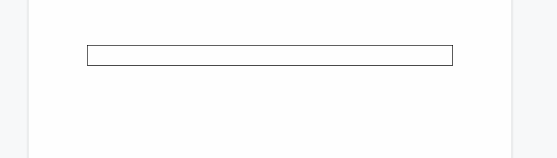
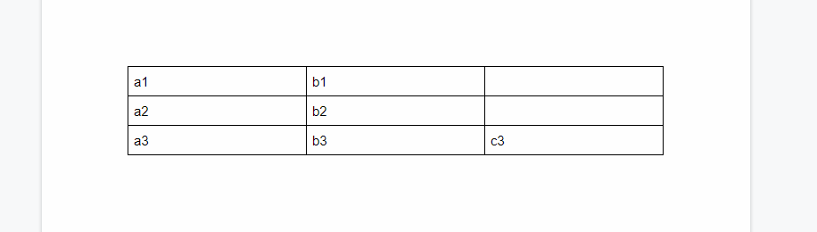
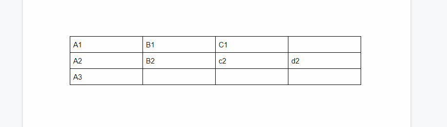
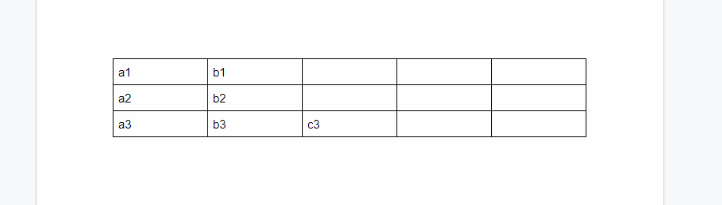
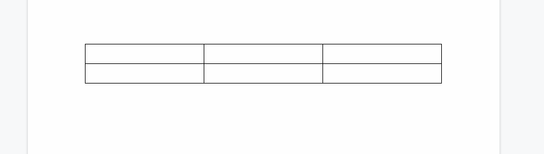
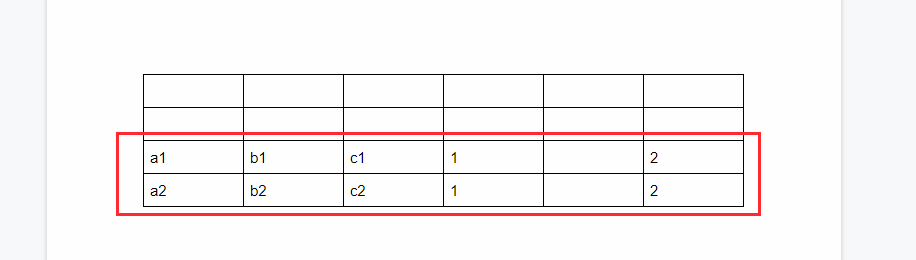
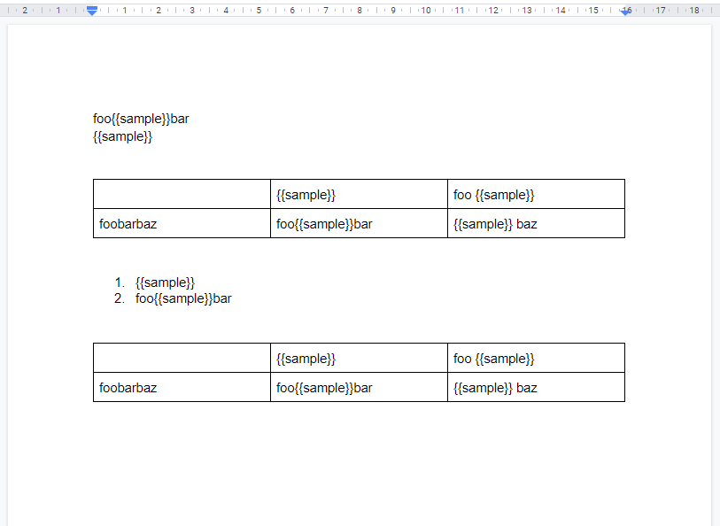
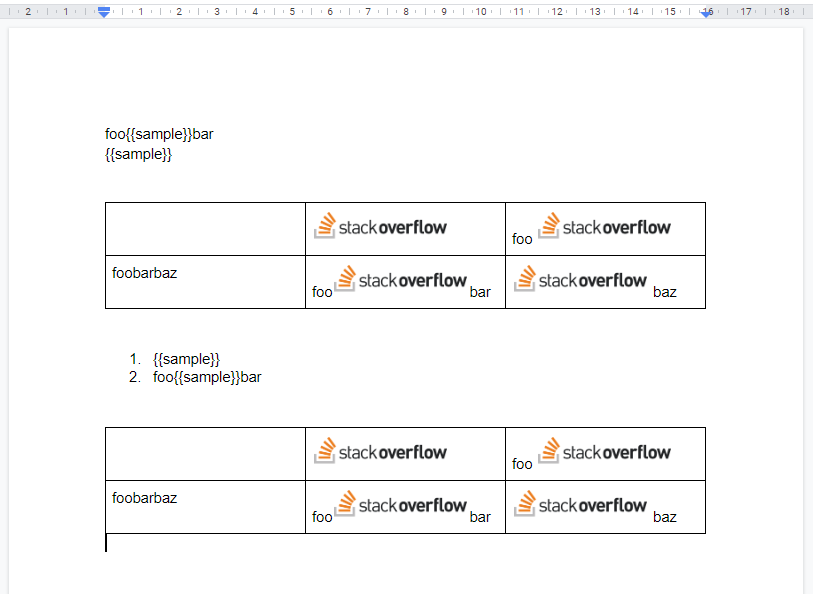
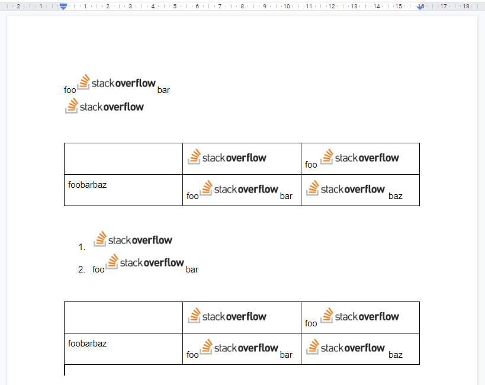

# gdoctableapppy

[](https://travis-ci.org/tanaikech/gdoctableapppy)
[](LICENCE)

<a name="top"></a>

# Overview

This is a python library to manage the tables on Google Document using Google Docs API.

# Description

Google Docs API has been released. When I used this API, I found that it is very difficult for me to manage the tables on Google Document using Google Docs API. Although I checked [the official document](https://developers.google.com/docs/api/how-tos/tables), unfortunately, I thought that it's very difficult for me. So in order to easily manage the tables on Google Document, I created this library.

## Features

- All values can be retrieved from the table on Google Document.
- Values can be put to the table.
- Delete table, rows and columns of the table.
- New table can be created by including values.
- Append rows to the table by including values.
- Replace texts with images.

      	- The image data can be retrieved from URL.
      	- The image data can be uploaded from the local PC.

## Languages

I manages the tables on Google Document using several languages. So I created the libraries for 4 languages which are golang, node.js and python. Google Apps Script has Class DocumentApp. So I has never created the GAS library yet.

- [go-gdoctableapp](https://github.com/tanaikech/go-gdoctableapp)
- [node-gdoctableapp](https://github.com/tanaikech/node-gdoctableapp)
- [gdoctableapppy](https://github.com/tanaikech/gdoctableapppy)
- [google-docs-table-factory](https://github.com/gumatias/google-docs-table-factory) by gumatias

# Install

```bash
$ pip install gdoctableapppy
```

You can also see this library at [https://pypi.org/project/gdoctableapppy/](https://pypi.org/project/gdoctableapppy/).

# Method

| Method                                            | Explanation                                     |
| :------------------------------------------------ | :---------------------------------------------- |
| [`GetTables()`](#gettables)                       | Get all tables from Document.                   |
| [`GetValues()`](#getvalues)                       | Get values from a table from Document.          |
| [`SetValues()`](#setvalues1)                      | Set values to a table with 2 dimensional array. |
| [`SetValues(`](#setvalues2)                       | Set values to a table with an object.           |
| [`DeleteTable()`](#deletetable)                   | Delete a table.                                 |
| [`DeleteRowsAndColumns()`](#deleterowsandcolumns) | Delete rows and columns of a table.             |
| [`CreateTable()`](createtable)                    | Create new table including sell values.         |
| [`AppendRow()`](#appendrow)                       | Append row to a table by including values.      |
| [`ReplaceTextsToImages()`](#replacetexts)         | Replace texts with images from URL or file.     |

This library uses [google-api-python-client](https://github.com/googleapis/google-api-python-client).

## Response

This library returns the following value.

```python
{
    'tables': [],
    'values': [],
    'responseFromAPIs': [],
    'libraryVersion': version
}
```

- When `GetTables()` is used, you can see the values with `tables`.
- When `GetValues()` is used, you can see the values with `values`.
- When other methods are used and the option of `showAPIResponse` is `true`, you can see the responses from APIs which were used for the method. And also, you can know the number of APIs, which were used for the method, by the length of array of `responseFromAPIs`.

# Usage

About the authorization, please check the section of [Authorization](#authorization). In order to use this library, it is required to confirm that [the Quickstart](https://developers.google.com/docs/api/quickstart/python) works fine.

## Scope

In this library, using the scope of `https://www.googleapis.com/auth/documents` is recommended.

<a name="gettables"></a>

## 1. GetTables

Get all tables from Document. All values, table index and table position are retrieved.

### Sample script

This sample script retrieves all tables from the Google Document of document ID.

```python
resource = {
    "oauth2": creds,
    "documentId": documentId,
    # "showAPIResponse": True
}
res = gdoctableapp.GetTables(resource) # You can see the retrieved values like this.
print(res)
```

- `documentId`: Document ID.
- `oauth2`: Credentials for using Docs API. Please check the section of [Authorization](#authorization).
  - If you want to use Service Account, please use `service_account` instead of `oauth2`. About this, please check [the sample script for Service account](#serviceaccount).
- `showAPIResponse`: When `showAPIResponse: true` is used to `resource`, the responses from Docs API can be seen. The default value is `false`. **This option can be used for all methods.**

<a name="getvalues"></a>

## 2. GetValues

Get values from the table. All values are retrieved.

### Sample script

This sample script retrieves the values from 1st table in Google Document. You can see the retrieved values as `[][]string`. Because when the values are retrieved by Docs API, all values are automatically converted to the string data.

```python
resource = {
    "oauth2": creds,
    "documentId": "###",
    "tableIndex": 0,
}
res = gdoctableapp.GetValues(resource)
print(res) # You can see the retrieved values like this.
```

- `documentId`: Document ID.
- `tableIndex`: Table index. If you want to use the 3rd table in Google Document. It's 2. The start number of index is 0.
- `oauth2`: Credentials for using Docs API. Please check the section of [Authorization](#authorization).
  - If you want to use Service Account, please use `service_account` instead of `oauth2`. About this, please check [the sample script for Service account](#serviceaccount).

<a name="setvalues1"></a>

## 3. SetValues 1

There are 2 patterns for putting values to the table. In this section, set values to the table with 2 dimensional array. When the rows and columns of values which are put are over those of the table, this method can automatically expand the rows and columns.

### Sample script

This sample script puts the values to the first table in Google Document.

```python
resource = {
    "oauth2": creds,
    "documentId": "###",
    "tableIndex": 0,
    "values": [["a1", "b1"], ["a2", "b2"], ["a3", "b3", "c3"]]
}
res = gdoctableapp.SetValues(resource)  # You can see the retrieved responses from Docs API.
print(res)
```

- `documentId`: Document ID.
- `tableIndex`: Table index. If you want to use the 3rd table in Google Document. It's 2. The start number of index is 0.
- `oauth2`: Credentials for using Docs API. Please check the section of [Authorization](#authorization).
  - If you want to use Service Account, please use `service_account` instead of `oauth2`. About this, please check [the sample script for Service account](#serviceaccount).
- `values`: `[][]string`

### Result

When above script is run, the following result is obtained.

#### From:



#### To:



<a name="setvalues2"></a>

## 4. SetValues 2

There are 2 patterns for putting values to the table. In this section, set values to a table with an object. In this method, you can set the values using the range. When the rows and columns of values which are put are over those of the table, this method can automatically expand the rows and columns.

### Sample script

This script puts the values with the range to the first table in Google Document.

```python
resource = {
    "oauth2": creds,
    "documentId": "###",
    "tableIndex": 0,
    "values": [
        {
            "values": [["A1"], ["A2", "B2", "c2", "d2"], ["A3"]],
            "range": {"startRowIndex": 0, "startColumnIndex": 0}
        },
        {
            "values": [["B1", "C1"]],
            "range": {"startRowIndex": 0, "startColumnIndex": 1}
        }
    ]
}
res = gdoctableapp.SetValues(resource)  # You can see the retrieved responses from Docs API.
print(res)
```

- `documentId`: Document ID.
- `tableIndex`: Table index. If you want to use the 3rd table in Google Document. It's 2. The start number of index is 0.
- `oauth2`: Credentials for using Docs API. Please check the section of [Authorization](#authorization).
  - If you want to use Service Account, please use `service_account` instead of `oauth2`. About this, please check [the sample script for Service account](#serviceaccount).
- `range.startRowIndex` of `values`: Row index of `values[0][0]`.
- `range.startColumnIndex` of `values`: Column index of `values[0][0]`.
- `values` : Values you want to put.

For example, when the row, column indexes and values are 1, 2 and "value", respectively, "value" is put to "C3".

### Result

When above script is run, the following result is obtained.

#### From:


#### To:



<a name="deleteuable"></a>

## 5. DeleteTable

### Sample script

This script deletes the first table in Google Document.

```python
resource = {
    "oauth2": creds,
    "documentId": "###",
    "tableIndex": 0
}
res = gdoctableapp.DeleteTable(resource)
print(res)  # You can see the retrieved responses from Docs API.
```

- `documentId`: Document ID.
- `tableIndex`: Table index. If you want to use the 3rd table in Google Document. It's 2. The start number of index is 0.
- `oauth2`: Credentials for using Docs API. Please check the section of [Authorization](#authorization).
  - If you want to use Service Account, please use `service_account` instead of `oauth2`. About this, please check [the sample script for Service account](#serviceaccount).

<a name="deleterowsandcolumns"></a>

## 6. DeleteRowsAndColumns

### Sample script

This script deletes rows of indexes of 3, 1 and 2 of the first table in Google Document. And also this script deletes columns of indexes of 2, 1 and 3.

```python
resource = {
    "oauth2": creds,
    "documentId": "###",
    "tableIndex": 0,
    "deleteRows": [3, 1, 2],  # Start index is 0.
    "deleteColumns": [2, 1, 3]  # Start index is 0.
}
res = gdoctableapp.DeleteRowsAndColumns(resource)
print(res)  # You can see the retrieved responses from Docs API.
```

- `documentId`: Document ID.
- `tableIndex`: Table index. If you want to use the 3rd table in Google Document. It's 2. The start number of index is 0.
- `oauth2`: Credentials for using Docs API. Please check the section of [Authorization](#authorization).
  - If you want to use Service Account, please use `service_account` instead of `oauth2`. About this, please check [the sample script for Service account](#serviceaccount).
- `deleteRows` : Indexes of rows you want to delete.
- `deleteColumns` : Indexes of columns you want to delete.

<a name="createtable"></a>

## 7. CreateTable

### Sample script

This script creates new table to the top of Google Document, and the cells of the table have values.

```python
resource = {
    "oauth2": creds,
    "documentId": "###",
    "rows": 3,
    "columns": 5,
    "createIndex": 1,
    # "append": True,  # When this is used instead of "Index", new table is created to the end of Document.
    "values": [["a1", "b1"], ["a2", "b2"], ["a3", "b3", "c3"]]
}
res = gdoctableapp.CreateTable(resource)
print(res)  # You can see the retrieved responses from Docs API.
```

- `documentId`: Document ID.
- `oauth2`: Credentials for using Docs API. Please check the section of [Authorization](#authorization).
  - If you want to use Service Account, please use `service_account` instead of `oauth2`. About this, please check [the sample script for Service account](#serviceaccount).
- `rows` : Number of rows of new table.
- `columns` : Number of columns of new table.
- `createIndex` : Index of Document for putting new table. For example, `1` is the top of Document.
- `append` : When `append` is `true` instead of `createIndex`, the new table is created to the end of Google Document.
- `values` : If you want to put the values when new table is created, please use this.

### Result

When above script is run, the following result is obtained. In this case, the new table is created to the top of Google Document.



<a name="appendrow"></a>

## 8. AppendRow

### Sample script

This sample script appends the values to the first table of Google Document.

```python
resource = {
    "oauth2": creds,
    "documentId": "###",
    "tableIndex": 0,
    "values": [["a1", "b1", "c1", 1, "", 2], ["a2", "b2", "c2", 1, "", 2]]
}
res = gdoctableapp.AppendRow(resource)
print(res)  # You can see the retrieved responses from Docs API.
```

- `documentId`: Document ID.
- `tableIndex`: Table index. If you want to use the 3rd table in Google Document. It's 2. The start number of index is 0.
- `oauth2`: Credentials for using Docs API. Please check the section of [Authorization](#authorization).
  - If you want to use Service Account, please use `service_account` instead of `oauth2`. About this, please check [the sample script for Service account](#serviceaccount).
- `values` : Values you want to append to the existing table.

### Result

When above script is run, the following result is obtained. In this case, the values are put to the last row. And you can see that 3 columns are automatically added when the script is run.

#### From:



#### From:



<a name="replacetexts"></a>

## 9. ReplaceTextsToImages

### Sample script

In this sample, the texts `{{sample}}` in all tables are replaced with the image. In this case, you can use the image from an URL or a file on local PC.

```python
resource = {
    "oauth2": creds,
    "documentId": "###",
    "showAPIResponse": False,  # default is false
    "tableOnly": True,  # default is false
    "searchText": "{{sample}}",
    "imageWidth": 50,
    "imageHeight": 50,
    "replaceImageURL": "https://###/sample.png"
    # "replaceImageFilePath": "./sample.png" # If you want to put the image in local PC, please use this.
}
res = gdoctableapp.ReplaceTextsToImages(resource)
print(res)
```

- `documentId`: Document ID.
- `oauth2`: Credentials for using Docs API. Please check the section of [Authorization](#authorization).
  - If you want to use Service Account, please use `service_account` instead of `oauth2`. About this, please check [the sample script for Service account](#serviceaccount).
- `searchText`: Search text. This text is replaced with image.
- `replaceImageURL`: URL of the image. When this property is used, the image is retrieved from the URL, and the retrieved image is used.
- `replaceImageFilePath`: File path of the image. When this property is used, the image is retrieved from the file on local PC, and the retrieved image is used.

- `imageWidth`: Width of the put image.
- `imageHeight`: Height of the put image.
- `tableOnly`: When this is `True`, only texts in the table are replaced with image. When this is `False`, the texts in the body are replaced.
- `showAPIResponse`: When `"showAPIResponse": True` is used to `resource`, the responses from Docs API can be seen. The default value is `False`.

### Note

- The flow for replacing the text with the image on the local PC.

  1. Upload the image from local PC to Google Drive.
  2. Publicly share the image file. - The time for sharing is several seconds. The file is delete after the image is put.
  3. Put the image using the URL of the publicly shared file.
  4. Delete the image. - Even when the image is delete from Google Drive, the put image on Google Document is not deleted.

- About `imageWidth` and `imageHeight`
  > [**objectSize**](https://developers.google.com/docs/api/reference/rest/v1/documents/request#insertinlineimagerequest): The size that the image should appear as in the document. This property is optional and the final size of the image in the document is determined by the following rules: _ If neither width nor height is specified, then a default size of the image is calculated based on its resolution. _ If one dimension is specified then the other dimension is calculated to preserve the aspect ratio of the image. \* If both width and height are specified, the image is scaled to fit within the provided dimensions while maintaining its aspect ratio.

### Result

When above script is run, the following result is obtained.

#### From:



#### To:



The image of `https://cdn.sstatic.net/Sites/stackoverflow/company/img/logos/so/so-logo.png` was used as the sample image.

When `tableOnly` is `False`, the following result is retrieved.



<a name="authorization"></a>

# Authorization

There are 2 patterns for using this library.

## 1. Use OAuth2

Document of OAuth2 is [here](https://developers.google.com/identity/protocols/OAuth2).

### Sample script

In this sample script, the authorization process uses [the Quickstart for Node.js](https://developers.google.com/docs/api/quickstart/nodejs). You can see the detail information at there.

```python
from __future__ import print_function
import pickle
import os.path
from google_auth_oauthlib.flow import InstalledAppFlow
from google.auth.transport.requests import Request

from gdoctableapppy import gdoctableapp

# If modifying these scopes, delete the file token.pickle.
SCOPES = ['https://www.googleapis.com/auth/documents']


def main():
    """Shows basic usage of the Docs API.
    Prints the title of a sample document.
    """
    creds = None
    # The file token.pickle stores the user's access and refresh tokens, and is
    # created automatically when the authorization flow completes for the first
    # time.
    if os.path.exists('token.pickle'):
        with open('token.pickle', 'rb') as token:
            creds = pickle.load(token)
    # If there are no (valid) credentials available, let the user log in.
    if not creds or not creds.valid:
        if creds and creds.expired and creds.refresh_token:
            creds.refresh(Request())
        else:
            flow = InstalledAppFlow.from_client_secrets_file(
                'credentials.json', SCOPES)
            creds = flow.run_local_server()
        # Save the credentials for the next run
        with open('token.pickle', 'wb') as token:
            pickle.dump(creds, token)

    resource = {
        "oauth2": creds,
        "documentId": "###",
        "tableIndex": 0,
    }
    res = gdoctableapp.GetValues(resource)
    print(res) # You can see the retrieved values like this.


if __name__ == '__main__':
    main()
```

<a name="serviceaccount"></a>

## 2. Use Service account

Document of Service account is [here](https://developers.google.com/identity/protocols/OAuth2ServiceAccount). When you use Service account, please share Google Document with the email of Service account.

### Sample script

```python
from google.oauth2 import service_account
from gdoctableapppy import gdoctableapp

SCOPES = ['https://www.googleapis.com/auth/documents']
SERVICE_ACCOUNT_FILE = 'service-account-credentials.json'
creds = service_account.Credentials.from_service_account_file(SERVICE_ACCOUNT_FILE, scopes=SCOPES)

resource = {
    "service_account": creds,
    "documentId": "###",
    "tableIndex": 0,
}
res = gdoctableapp.GetValues(resource)
print(res) # You can see the retrieved values like this.
```

# Limitations

- In the current stage, unfortunately, `tableCellStyle` cannot be modified by Google Docs API. By this, the formats of cells cannot be modified. About this, I have posted as [Feature Request](https://issuetracker.google.com/issues/135136221).

# References:

- Official document: [Inserting or deleting table rows](https://developers.google.com/docs/api/how-tos/tables#inserting_or_deleting_table_rows)
- If you want to know the relationship between the index and startIndex of each cell, you can see it at [here](https://stackoverflow.com/a/56944149).

---

<a name="licence"></a>

# Licence

[MIT](LICENCE)

<a name="author"></a>

# Author

[Tanaike](https://tanaikech.github.io/about/)

If you have any questions and commissions for me, feel free to tell me.

<a name="updatehistory"></a>

# Update History

- v1.0.0 (July 18, 2019)

  1. Initial release.

- v1.0.5 (January 21, 2020)

  1. When the inline objects and tables are put in the table. An error occurred. This bug was removed by this update.

- v1.1.0 (January 22, 2020)

  1. [New method was added.](#replacetexts) From this version, the texts can be replaced by images. The direct link and local file can be used as the image.

[TOP](#top)
